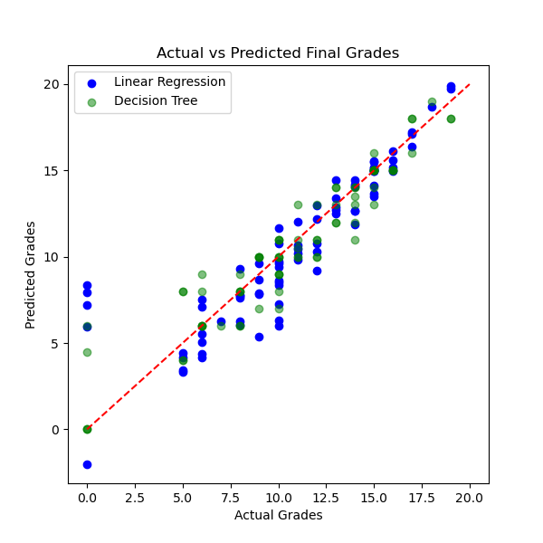

# 🎓 Student Performance Predictor

This project predicts students' final exam grades using Machine Learning models such as **Linear Regression** and **Decision Tree Regressor**. The model is trained on the UCI Student Performance Dataset and includes exploratory data analysis, feature selection, training, evaluation, and result visualization.

---

## 📁 Dataset

- **Source:** [UCI Machine Learning Repository – Student Performance Data Set](https://archive.ics.uci.edu/ml/datasets/Student+Performance)
- **File Used:** `student-mat.csv`
- **Description:** Contains demographic, social, and academic performance data for Portuguese students.

---

## 🔧 Features Used

| Feature      | Description                             |
|--------------|-----------------------------------------|
| `studytime`  | Weekly study time (1–4 scale)           |
| `failures`   | Number of past class failures           |
| `absences`   | Number of school absences               |
| `G1`         | First-period grade (0–20 scale)         |
| `G2`         | Second-period grade (0–20 scale)        |
| `G3`         | Final grade (target variable, 0–20)     |

---

## 🧠 Models Used

- **Linear Regression**
- **Decision Tree Regressor**

These models were trained using scikit-learn, and their performance was evaluated using:
- Mean Squared Error (MSE)
- R² Score (coefficient of determination)

---

## 📊 Exploratory Data Analysis (EDA)

- Checked for missing values and data types
- Visualized correlations using a heatmap
- Analyzed feature relationships to final grade (`G3`)

**Correlation Heatmap:**

 

---

## 📈 Model Results

| Model                 | MSE (↓) | R² Score (↑) |
|-----------------------|---------|--------------|
| Linear Regression     | 4.46    | 0.78         |
| Decision Tree Regressor | 2.25  | 0.89         |

**Actual vs Predicted Plot:**

---

## 🚀 How to Run

1. Clone this repository:
   git clone [https://github.com/yourusername/student-performance-predictor.git](https://github.com/Tilaksavani/Student_Performance_Predictor.git)
   cd student-performance-predictor

2. Install the dependencies:
    pip install -r requirements.txt

3. Run the Jupyter notebook:
    jupyter notebook

4. Open student_performance_predictor.ipynb and run all cells.

---

## 🧰 Tools & Libraries
Python
Pandas
NumPy
Matplotlib
Seaborn
scikit-learn
Jupyter Notebook

---

## 📄 License
This project is open-source and available under the MIT License.

---

## 🙋‍♂️ Author
**Tilak Savani**  
Master's in Computer Science | University of Georgia  
Domain: Artificial Intelligence & Machine Learning

---

## ⭐ Credits

- [UCI Machine Learning Repository](https://archive.ics.uci.edu/ml/datasets/Student+Performance)
- [scikit-learn developers](https://scikit-learn.org/)
